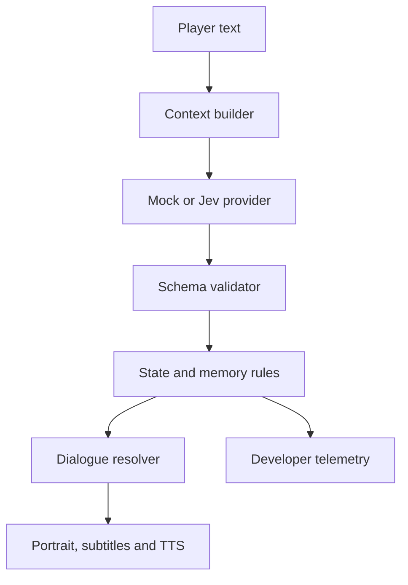

# Jev NPC: Retro CD-ROM Vertical Slice

## Design specification and development roadmap

**Status:** Repository-audited next-stage design  
**Scope:** One location, one NPC, one complete encounter  
**Target:** Desktop web browser first  
**Reference mood:** mid-1990s FMV CD-ROM games, especially the urgency and communication panels of *Command & Conquer: Red Alert* and the character-led cockpit conversations of *Wing Commander III*  

**Repository audited:** [dazreil/jev-npc-interaction-prototype](https://github.com/dazreil/jev-npc-interaction-prototype), commit `de767cf`  
**Audit date:** 20 September 2026  

---

## 1. Project goal

Transform the current Arthur warehouse-guard prototype into a short, polished retro CD-ROM game encounter without replacing its decision architecture.

The player must persuade, deceive, intimidate or otherwise influence Arthur to gain entry to a warehouse. The player types freely. Jev interprets the situation and selects from valid authored NPC actions. The game supplies the written line, performance, portrait animation, sound and state changes.

The finished slice should feel like a lost 1995 PC game: pixelated photographic characters, small low-frame-rate FMV panels, crunchy speech, industrial interface graphics and immediate dramatic feedback.

This is not intended to become a general RPG engine yet. It is a focused proof that authored dialogue can feel reactive when a decision model controls character behaviour and performance.

## 2. Verified state of the vertical slice

The repository is already a complete, tested decision prototype. Its original roadmap phases 0–8 are marked complete. The retro conversion should preserve this working core and replace the presentation layer around it.

### Audit result

| Area | Verified implementation |
| --- | --- |
| Runtime | Vanilla HTML, CSS, JavaScript and a small Node server; no packages or build step. |
| Providers | Deterministic Mock provider plus live TypeSafe Jev adapter using `jev-latest`. |
| Security | Same-origin server proxy keeps `TYPESAFE_API_KEY` out of browser code. |
| Action model | 12 bounded actions, including weapon de-escalation and conversation repair. |
| Dialogue | 143 authored fragments, 13 template entries, 6 conditional branches and 162 possible rendered lines. |
| State | Trust, suspicion, irritation and fear, clamped to 0–100. |
| Memory | Up to eight structured important memories plus six recent exchanges. |
| Outcomes | Entry success and conversation-ended failure. |
| Assets | Static Arthur portrait, four speaking frames, animated speaking GIF and player silhouette. |
| Inspection | Live state, decision, confidence, reason, memory, exact provider context and raw response. |
| Verification | 27 automated tests pass; dialogue lint passes with no warnings. |
| Evaluation | Mock and Jev both passed 14/14 core scenarios; Jev passed 5/5 unfamiliar-phrasing probes while Mock passed 0/5. |

### What is already strong

- The provider boundary is clean and tested.
- Jev selects only an action from the supplied allow-list.
- All spoken dialogue remains authored.
- Invalid decisions fall back safely.
- A failed network attempt consumes no turn and preserves the player's input.
- Memory, contradiction, repair, threats and proof-based entry routes work.
- The dialogue system already supports deterministic templates, slots and contextual branches.
- Arthur already animates while replying, although the animation is a fixed 920 ms GIF rather than speech-driven performance.

### What must change

The current interface is a polished modern two-column chat application with responsive cards, rounded controls, large typography, chat bubbles and an always-visible debug sidebar. It has atmosphere, but it does not yet resemble a 1990s CD-ROM game.

The conversion therefore needs to:

- Replace the modern chat layout with a fixed 4:3 in-world terminal.
- Promote Arthur from a small avatar to the main communications image.
- Move history into a compact transcript rather than alternating chat bubbles.
- Hide developer inspection during ordinary play without removing it.
- Replace the fixed speaking GIF timer with an explicit performance lifecycle.
- Add speech synthesis, captions timing, audio processing and accessibility controls.
- Extend the existing portrait frames into emotional reaction states.
- Add two additional explicit non-success outcomes so the encounter has four authored endings.

### Technical shape

- Vanilla HTML, CSS and JavaScript.
- JSON content files.
- No framework, database or build system unless Jev requires one.
- A mock decision provider and a working Jev provider behind the same interface.
- One warehouse entrance and one NPC: Arthur, the guard.
- Free-text player input.
- Reset control, mock/Jev toggle and provider-health check.
- Developer panel showing live decision and state data.

### Decision model

Jev receives bounded context:

- Arthur's personality.
- Arthur's goals.
- Current emotional and relationship state.
- World state.
- Relevant memories.
- Recent conversation history.
- Latest player input.
- The list of actions currently available.

Jev selects a valid action; it does not write dialogue.

Verified action vocabulary:

- `ANSWER_QUESTION`
- `REFUSE_ENTRY`
- `ASK_FOR_REASON`
- `ASK_FOR_PROOF`
- `ALLOW_ENTRY`
- `WARN_PLAYER`
- `DEESCALATE_THREAT`
- `THREATEN_PLAYER`
- `SHOW_SYMPATHY`
- `BECOME_SUSPICIOUS`
- `REPAIR_CONVERSATION`
- `END_CONVERSATION`

### Arthur's initial model

| Category | Value |
| --- | --- |
| Personality | patience 35, greed 25, courage 70, sympathy 55, rule-following 80 |
| Initial state | trust 20, suspicion 40, irritation 10, fear 5 |
| Goals | protect the warehouse, keep his job, avoid trouble |

All mutable values remain within 0–100. Invalid provider output must be rejected and replaced with a safe fallback action.

### Existing tone rule

The original deterministic performance rule is:

1. Irritation above 70: hostile.
2. Otherwise irritation above 40: irritated.
3. Otherwise trust above 65: friendly.
4. Otherwise: neutral.

This remains a valid fallback. The new presentation system expands it without giving Jev control of unbounded prose or assets.

## 3. Design pillars

### Authored, not generated

Every spoken sentence is written in advance. Jev chooses intent and behaviour; the game chooses a compatible authored line and delivery. This keeps Arthur coherent, makes the encounter testable and prevents modern AI prose from breaking the 1990s illusion.

### Performance communicates state

Arthur's changing attitude must be visible and audible before the player opens the debug panel. Portrait, pose, expression, delivery rate, pauses, interface colour and incidental sound all reinforce his state.

### Low fidelity is deliberate

Small images, limited animation, dithering and compressed audio are not damage filters applied at the end. Assets should be designed for their final size and judged at that size.

### One encounter, several stories

The slice succeeds if players can reach different outcomes through meaningfully different approaches and Arthur can remember an earlier claim, contradiction or provocation.

### The simulation remains inspectable

The cinematic interface is the player experience. The existing diagnostic view remains available behind a developer toggle so every decision can be explained and replayed.

## 4. Player experience

### Premise

The player arrives at a warehouse entrance after hours. Arthur has been told not to admit anyone without a credible reason or proof. The exact wider story can remain deliberately thin in the slice; the interaction is the event.

### Core loop

1. Arthur delivers an authored prompt.
2. The player types a reply.
3. The game assembles Arthur's decision context.
4. Jev or the mock provider selects a permitted action.
5. The validator accepts the action or substitutes a safe fallback.
6. Rules apply bounded state and memory changes.
7. The dialogue resolver selects an authored line variant.
8. The performance system plays Arthur's visual and vocal response.
9. The interface returns control to the player or resolves an ending.

### Outcomes

The first complete version should support at least four explicit endings:

| Outcome | Meaning |
| --- | --- |
| Entry granted | Arthur permits the player through. |
| Refused | Arthur closes the conversation but does not escalate. |
| Expelled | Arthur threatens or orders the player away. |
| Locked out | Suspicion reaches a critical state after contradiction or obvious deception. |

An ending must arise from state plus an authored action, not a single hidden keyword.

## 5. Presentation direction

### Screen composition

Design for a fixed logical canvas, recommended at **640×480 in 4:3**, then scale it to the browser window using integer scaling where practical.

The player-facing screen contains:

- A warehouse exterior or security-station background.
- A prominent but compact communications window for Arthur.
- A subtitle/dialogue log panel.
- A single-line or short multiline text entry field.
- Small status lamps and system labels that provide atmosphere without exposing raw simulation numbers.
- Minimal controls: submit, replay last line, captions, audio and developer view.

Avoid turning the main interface into a modern chat application. It should read as an in-world security terminal or video intercom.

### Visual language

- Pixelated photographic realism rather than hand-drawn pixel art.
- Low-resolution source portrait, suggested internal size 160×120 or 192×144.
- Nearest-neighbour scaling.
- Restricted colour palette or indexed-colour treatment.
- Ordered dithering, light colour banding and restrained compression artefacts.
- Chunky bevels, inset panels, warning stripes, stamped labels and hardware-like indicators.
- Muted industrial colours with a small number of strong alert colours.
- No fake CRT curvature by default. Scanlines, bloom and noise should be subtle and optional.

The influence should come from the period's composition and constraints, not from copying either reference game's interface.

### Arthur portrait system

Full generated video is unnecessary for the slice. Arthur uses short frame sequences or sprite strips:

- Neutral idle.
- Blink.
- Talk A/B/C.
- Suspicious.
- Irritated.
- Hostile.
- Friendly or softened.
- Thinking/listening.
- Dismissive ending.
- Entry-granted ending.

The animation controller alternates talk frames from speech events or approximate timing. Non-speaking reaction frames can play before or after a line. Target playback is roughly 6–12 fps, depending on the sequence.

### Audio direction

The baseline voice solution should be cheap enough to run freely during development.

1. Start with the browser Web Speech API for zero-cost integration.
2. Add a consistent local/WASM voice provider such as eSpeak if cross-device consistency becomes more important than natural delivery.
3. Keep the speech provider replaceable; dialogue resolution must not depend on it.

The final signal chain should evoke period speech:

- Mono output.
- 22.05 kHz target character, or a similar downsampled sound.
- Mild band-limiting and compression.
- Very light noise or radio/intercom distortion.
- Short start/end clicks where appropriate.
- Subtitles always available and enabled by default.

Do not process speech so heavily that words become difficult to understand.

### Soundscape

- Fluorescent or electrical hum.
- Rain, distant traffic or industrial ambience.
- Interface clicks and relay sounds.
- A short alert sting when suspicion crosses a threshold.
- A mechanical unlock sound when entry is granted.
- Sparse, low-bitrate music or no music during the conversation.

## 6. Narrative and dialogue design

### Dialogue record

Each authored line should be content plus performance metadata, for example:

```json
{
  "id": "arthur.ask_proof.irritated.01",
  "action": "ASK_FOR_PROOF",
  "tone": "irritated",
  "text": "Then show me something with your name on it.",
  "requirements": {
    "minIrritation": 41,
    "maxIrritation": 70
  },
  "performance": {
    "portraitSequence": "talk_irritated",
    "reactionIn": "suspicious_glance",
    "voiceRate": 0.94,
    "voicePitch": 0.82,
    "pauseBeforeMs": 250,
    "audioPreset": "intercom"
  },
  "effects": {
    "suspicion": 4,
    "irritation": 2
  }
}
```

State effects should normally belong to tested game rules rather than dialogue records. If kept in content for authoring convenience, validate them against a strict allow-list and per-turn limits.

### Tone expansion

Use a small controlled set:

- `neutral`
- `wary`
- `irritated`
- `hostile`
- `friendly`
- `afraid`

Tone is selected deterministically from state and action. Jev may return confidence and reasoning for diagnostics, but it should not directly select arbitrary performance assets.

### Memory

The slice needs only memories that materially affect later choices:

- The player's stated reason for entry.
- Claimed identity, employer or relationship.
- Evidence offered.
- A promise, bribe or threat.
- A detected contradiction.
- Arthur's last warning.

Memories should be structured facts with source turn and confidence, not free-form summaries that grow indefinitely.

### Input interpretation

The game should record useful features of the player's message—question, request, claimed reason, evidence, threat, appeal, bribe and contradiction—without allowing the interpreter to determine the outcome on its own. Arthur's state, traits, goals, memories and available actions remain part of the decision.

## 7. System architecture

Keep the existing provider boundary and separate simulation from presentation.



### Recommended modules

| Module | Responsibility |
| --- | --- |
| `game` | Turn lifecycle, endings, reset and input lock. |
| `npc` | Arthur's traits, goals and mutable state. |
| `context` | Builds the provider request from approved data. |
| `providers/mock` | Deterministic local behaviour for development and tests. |
| `providers/jev` | Jev transport and response normalisation only. |
| `validation` | Schema, action allow-list and fallback handling. |
| `state-rules` | Bounded state changes, thresholds and outcome rules. |
| `memory` | Structured memory creation, relevance and limits. |
| `dialogue` | Resolves action and tone to an authored line. |
| `performance` | Coordinates portrait animation, subtitles and timing. |
| `speech` | Replaceable Web Speech/eSpeak implementation. |
| `audio` | Ambience, UI sounds, filters and volume settings. |
| `debug` | Decision trace, provider data and reproducible turn log. |

### Provider contract

The provider response should remain narrow:

```json
{
  "action": "ASK_FOR_PROOF",
  "confidence": 0.82,
  "reason": "The player claims to be expected but has supplied no evidence.",
  "memoryOperations": [
    {
      "type": "remember_claim",
      "key": "visit_reason",
      "value": "repair call-out"
    }
  ]
}
```

Only allow known actions and known memory-operation types. Treat `reason` as diagnostic text; never display it in the fiction. If the provider times out, returns malformed data or chooses an illegal action, use a deterministic fallback and keep the encounter playable.

### Presentation state machine

The UI requires explicit phases:

- `IDLE`
- `PLAYER_TYPING`
- `DECIDING`
- `REACTION_IN`
- `SPEAKING`
- `REACTION_OUT`
- `AWAITING_PLAYER`
- `ENDING`

Input is disabled during decision and performance playback, with a skip control available after a short delay. Skipping completes subtitles and applies game state exactly once.

## 8. Conversion roadmap

The repository's existing phases 0–8 are complete. The CD-ROM conversion should continue from Phase 9 rather than restarting the project.

### Phase 9 — Presentation boundary and regression lock

**Purpose:** Protect the verified simulation while the front end is replaced.

Tasks:

- Preserve the current commit as the pre-conversion baseline.
- Add a renderer-facing `npcPerformance` object containing action, tone, line, portrait cue and timing defaults.
- Add explicit UI phases: `IDLE`, `DECIDING`, `REACTION_IN`, `SPEAKING`, `REACTION_OUT`, `AWAITING_PLAYER` and `ENDING`.
- Move Arthur's 920 ms portrait timer out of general UI rendering and into the performance controller.
- Ensure state is applied once even when dialogue is skipped or speech fails.
- Add tests for performance mapping and lifecycle completion.

**Do not change:** Provider requests, Jev parsing, state consequences, memory rules or dialogue selection.

**Exit gate:** `npm run check` still passes, and every existing scripted scenario produces the same actions, dialogue and final state with rendering disabled.

### Phase 10 — 4:3 CD-ROM interface shell

**Purpose:** Replace the modern chat presentation with the new game identity using existing assets.

Tasks:

- Build a 640×480 logical stage with responsive letterboxing.
- Create an in-world warehouse security-terminal frame.
- Give Arthur a large 160×120 or 192×144 communications viewport.
- Replace alternating chat bubbles with a subtitle area and compact scrollable transcript.
- Retain free-text entry, provider status, reset and accessibility controls.
- Move the debug panel into a modal/drawer opened by a developer control or keyboard shortcut.
- Preserve semantic labels, focus order and reduced-motion support.
- Use nearest-neighbour scaling and a deliberately restricted palette.

**Exit gate:** The whole existing encounter is playable in the 4:3 shell at 100%, 2× and responsive scale, with no lost diagnostic capability.

### Phase 11 — Arthur performance system

**Purpose:** Turn the existing portrait and four mouth frames into a state-aware performance layer.

Tasks:

- Reprocess the existing Arthur images for their final low-resolution display size.
- Replace the single speaking GIF with frame-controlled animation.
- Support idle, blink, listening and talk A/B/C from the current asset set.
- Create or derive suspicious, irritated, hostile, friendly and afraid reaction frames.
- Map action plus deterministic tone to reaction-in, speaking and reaction-out cues.
- Allow a neutral fallback whenever an emotional asset is missing.
- Add subtle connection glitches or frame drops as authored effects, not random constant noise.

**Exit gate:** Blind testers can identify at least four broad Arthur attitudes without seeing the debug values.

### Phase 12 — Speech and period audio

**Purpose:** Add effectively free speech whose limitations support the art direction.

Tasks:

- Introduce a replaceable `speech` adapter.
- Implement browser `speechSynthesis` first.
- Add per-line or per-tone rate, pitch, pre-delay and audio-preset metadata.
- Drive talk frames for the duration of actual speech events rather than a fixed timer.
- Add subtitles, mute, volume and replay-last-line controls.
- Add an optional Web Audio chain for mono, band-limited, compressed intercom character.
- Add warehouse ambience, UI relays, warning sting and door-unlock sound.
- Evaluate eSpeak/WASM after the browser version works; adopt it only if consistent cross-device voices justify the download and complexity.

**Exit gate:** Every line is understandable, speech failure never blocks play, captions remain complete, and talk animation begins and ends with delivery.

### Phase 13 — Outcome and authored-performance pass

**Purpose:** Use the stronger presentation to turn the tested conversation into a complete short game scene.

Tasks:

- Keep the existing success and ended-conversation outcomes.
- Split failure presentation into authored `refused`, `expelled` and `locked_out` endings while retaining compatible simulation actions.
- Add an opening connection sequence and one short transition for each ending.
- Add performance metadata to dialogue incrementally, with sensible defaults for all 162 possible lines.
- Audit repetition and ensure common paths do not reuse the same visible performance too often.
- Keep dialogue text and simulation consequences unchanged unless human playtests identify a specific problem.

**Exit gate:** Four presentation outcomes are visible, at least three strategies can gain entry, and all dialogue entries resolve to a valid performance without bespoke metadata being mandatory.

### Phase 14 — Provider and human evaluation

**Purpose:** Verify that the cinematic layer improves character perception without hiding decision problems.

Tasks:

- Re-run all Mock and live Jev automated scenarios.
- Confirm action parity with the pre-conversion report.
- Conduct blind sessions using the existing `MANUAL_PLAYTEST.md`.
- Add questions about emotional legibility, voice intelligibility, waiting time, retro authenticity and whether Arthur appears more agentic.
- Record device/browser voice differences.
- Tune performance timing before changing decision rules.

**Exit gate:** Automated results remain green; players can explain Arthur's attitude and perceive prior behaviour affecting him without opening debug mode.

### Phase 15 — Release polish

**Purpose:** Deliver a compact, stable vertical slice suitable for sharing.

Tasks:

- Finalise UI art, colour reduction, dithering and asset compression.
- Add slight ambient movement to the player's shadowed avatar without facial animation or revealing any facial detail; respect reduced-motion preferences.
- Add boot screen, loading/connection feedback and credits.
- Test keyboard-only play, focus visibility, captions and reduced motion.
- Test current Chrome, Edge, Firefox and Safari versions.
- Preload only immediate portrait and audio assets.
- Add a simple deploy configuration without introducing a frontend framework.
- Document Mock-only deployment and Jev-enabled server deployment separately.

**Exit gate:** A new player can load, understand and complete the encounter without guidance, while a developer can still reproduce and inspect every decision.

## 9. Priority order

The shortest useful route is:

1. Lock the existing 27-test baseline.
2. Add the performance controller without changing simulation output.
3. Build the 640×480 security-terminal shell with current assets.
4. Convert the existing mouth frames from fixed GIF timing to controlled animation.
5. Add browser speech and intercom audio treatment.
6. Add emotional reaction frames and four presentation endings.
7. Re-run Mock/Jev evaluation and conduct blind human playtests.
8. Produce final interface art and deployment polish.

Do not begin with dozens of finished portraits or prerecorded lines. First prove one representative response across four tones and one complete conversation through the new performance pipeline.

## 10. First playable milestone

The first retro milestone is deliberately small:

- One warehouse terminal background.
- Existing Arthur portrait and four mouth frames.
- All twelve existing actions and all current dialogue.
- Neutral delivery plus existing deterministic tone metadata.
- Browser speech synthesis plus subtitles.
- Mock and Jev provider switching retained.
- Existing success and failure endings.
- Debug panel moved behind a developer control.

This milestone proves the entire pipeline before the full dialogue set is converted.

## 11. Definition of done for the upgraded vertical slice

- The game opens directly into a coherent 4:3 retro interface.
- The player communicates through free text rather than menu dialogue choices.
- Jev selects only valid authored actions.
- Arthur never speaks unapproved generated prose.
- State and structured memories influence later decisions.
- Portrait and delivery visibly change with Arthur's attitude.
- Speech has a deliberately low-fidelity period character and can be muted.
- Subtitles make the game fully playable without audio.
- Four endings are reachable through more than one wording.
- Provider failure produces a valid fallback rather than a dead end.
- The mock path remains available for offline testing.
- The diagnostic panel explains every accepted decision and state change.
- The complete encounter is short, replayable and visually recognisable as a mid-1990s CD-ROM game.

## 12. Deferred until after the slice

- Multiple locations or NPCs.
- Inventory and general quest systems.
- A visual dialogue editor.
- Full-motion generated video.
- Cloud voice generation or per-character paid voices.
- Save accounts or a backend database.
- General-purpose modding support.
- Mobile-first layout.
- A framework migration.

These become reasonable only after Arthur demonstrates that the Jev-directed authored-performance model is fun and legible.

## 13. Immediate Codex task

The repository is now audited. The next implementation task should be:

> Implement Phase 9 only. Preserve all current provider, dialogue, memory and state behaviour. Add a small presentation controller with explicit lifecycle states and a renderer-facing `npcPerformance` object. Replace the fixed 920 ms speaking timeout with lifecycle-controlled timing while retaining the current portrait and GIF as fallbacks. Add focused tests, run `npm run check`, and document the file-by-file changes. Do not redesign the interface or add TTS in this phase.
